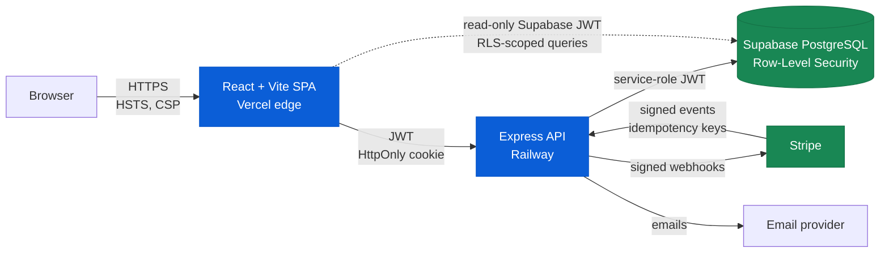

# Architecture

> System architecture, deployment topology, and request lifecycle for the Forsman CRM. No source code is included.

## High-level topology



The frontend never has direct write access to the database. All mutations go through the Express API, which enforces RBAC before delegating to Supabase. Read paths can use the Supabase JS client directly, but **only with an RLS-scoped JWT**, so the database itself is the last line of defense if the API layer fails.

## Deployment topology

| Tier | Where | Why |
|---|---|---|
| Static SPA | Vercel | Edge caching, automatic HTTPS, easy preview deploys. |
| API | Railway | Long-lived Node process, simple env management, regional pinning. |
| Database | Supabase (managed Postgres) | Built-in RLS, point-in-time recovery, managed backups. |
| Payments | Stripe | Industry-standard PCI offloading. |
| Secrets | Railway env + Supabase Vault | No secrets in repo, no secrets in client bundles. |
| Logs | Railway + Supabase audit tables | Application logs separate from privileged-action audit log. |

## Request lifecycle (write path)

1. **Client → Edge**: SPA sends fetch with HttpOnly session cookie. CSP and HSTS enforced at the edge.
2. **Edge → API**: Express receives request. Middleware chain runs: rate limiter → CSRF check → JWT verify → tenant resolver → RBAC guard → handler.
3. **API → DB**: Handler uses a per-request Postgres client whose JWT carries `tenant_id` and `role`. Every query is parameterized; ad-hoc SQL is forbidden by lint rule.
4. **DB enforcement**: RLS policies on every tenant-scoped table check `tenant_id = auth.tenant()`. If the API ever omits a `WHERE tenant_id =` clause by mistake, the database refuses anyway.
5. **Audit**: Privileged actions (admin invites, role changes, exports, billing) write to an append-only `audit_log` table inside the same transaction as the action.
6. **Response**: API returns JSON. No PII fields in URLs, ever.

## Tenant isolation

Tenant isolation is the single most important property of a B2B SaaS. The Forsman CRM enforces it at **three layers**:

1. **JWT claims**: every API request carries a JWT with `tenant_id`. The API rejects requests where a body parameter or path segment names a different `tenant_id`.
2. **API-side RBAC**: a `requireTenantMember(roles)` middleware short-circuits the handler before it ever touches the database.
3. **Database-side RLS**: every tenant-scoped table has a Postgres policy of the form `USING (tenant_id = current_setting('jwt.tenant_id')::uuid)`. RLS is **forced** (`ALTER TABLE ... FORCE ROW LEVEL SECURITY`) so even superusers can't accidentally bypass it from a connection pool with stale settings.

A defect at any one layer does not leak data, because the other two layers will catch it. This is the **defense-in-depth** principle applied to the boundary that B2B SaaS most often breaches.

## Authentication architecture

```
┌─────────────┐    1. POST /auth/login           ┌─────────────┐
│   Browser   │ ───────────────────────────────► │     API     │
└─────────────┘                                   └─────────────┘
       ▲                                                 │
       │     2a. Set-Cookie: session=…                   │
       │         HttpOnly, Secure, SameSite=Strict       │
       │     2b. JSON: { user, tenant, roles }           │
       └─────────────────────────────────────────────────┘

       3. Subsequent requests:
          - Cookie carries opaque session ID
          - API derives JWT (short-lived, 15 min) for downstream use
          - Refresh-token rotation on every refresh
          - Detected reuse of an old refresh token => session terminated everywhere
```

- **Access tokens**: 15-minute lifetime. Never seen by the browser; held server-side. The browser only sees the opaque session cookie.
- **Refresh-token rotation**: every refresh issues a new refresh token and invalidates the old one. Reuse of an invalidated token (the classic compromise signal) terminates all sessions for that user.
- **MFA-ready**: TOTP enrollment lives behind a feature flag and can be required at the tenant level (compliance posture for HIPAA-aware tenants).

## Data layer

- **Schema**: all tenant-scoped tables include `tenant_id uuid NOT NULL` and a corresponding RLS policy.
- **Migrations**: forward-only, reviewed, with rollback scripts kept separately.
- **PII columns**: encrypted at rest with AES-256-GCM, keys held outside the database (Supabase Vault). Encryption is **column-level**, not just disk-level — a compromised database backup does not yield plaintext PII without the key store.
- **Backups**: managed nightly snapshots, plus point-in-time recovery (PITR) within the retention window.

## Secrets management

- No secret is committed to source control. CI checks block any `*.env` or anything matching common credential regexes.
- All runtime secrets live in Railway env or Supabase Vault.
- API keys are scoped to least privilege — the Stripe restricted key the API uses cannot list customers, only operate on the ones it created.

## Observability

- **Application logs**: structured JSON, shipped from Railway.
- **Audit log**: separate table, append-only, written in the same transaction as the privileged action. Never deleted, never edited.
- **Health checks**: `/healthz` (liveness) and `/readyz` (DB connectivity) on the API.

## What's intentionally NOT here

- The schema DDL.
- Migrations.
- Any code.
- Configuration files (Vercel, Railway, Supabase).
- Sample data fixtures (even fake ones can leak business logic).

This repo is a write-up, not a code drop. If you'd like to discuss the architecture in more depth, [reach out on LinkedIn](https://linkedin.com/in/batuhan-satilmis).
